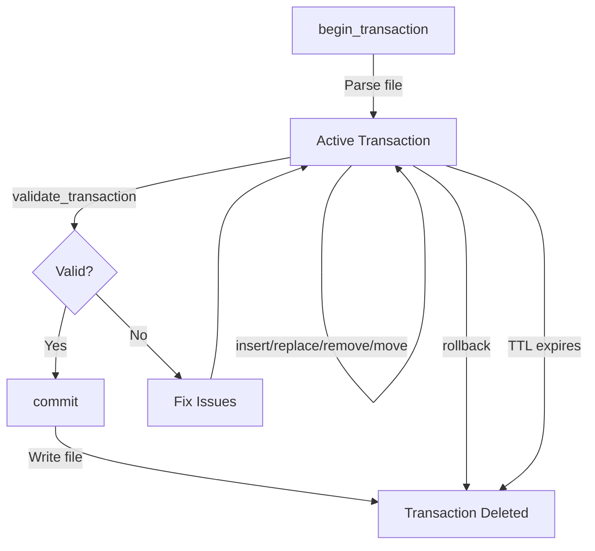

# Scalpel MCP Server

Multi-language structural code editing server implementing Model Context Protocol (MCP).

## Current Status

**✅ Supported Languages**: TypeScript, JavaScript, Java  
**🚧 Experimental**: Dart (compatibility issues with tree-sitter-dart@1.0.0)  
**📋 Planned**: Rust, Python, Go

Scalpel provides deterministic syntax tree mutations through persistent node identities and transactional editing. Instead of text diffs, Scalpel operates on stable AST nodes with structural validation.

## Language Support

| Language | Status | Parser | Node Types |
|----------|--------|--------|------------|
| TypeScript | ✅ Stable | tree-sitter-typescript@0.23.2 | `program`, `function_declaration`, `class_declaration`, `string`, `identifier`, etc. |
| JavaScript | ✅ Stable | tree-sitter-javascript@0.25.0 | `program`, `function_declaration`, `class_declaration`, `string`, `identifier`, etc. |
| Java | ✅ Stable | tree-sitter-java@0.23.5 | `program`, `class_declaration`, `method_declaration`, `string_literal`, `identifier`, etc. |
| Dart | 🚧 Experimental | tree-sitter-dart@1.0.0 | Compatibility issues - use with caution |
| Rust | 📋 Planned | - | Future release |
| Python | 📋 Planned | - | Future release |
| Go | 📋 Planned | - | Future release |

**Note**: All languages share the same AST mutation API. Node type names vary by language (e.g., `string` in TypeScript vs `string_literal` in Java), but the descriptor system abstracts these differences.

## Features

- **Persistent Node Identity** — AST nodes maintain stable IDs across reparses (>99.5% stability target)
- **Structural Mutations** — Insert, replace, remove, and move nodes with grammar validation
- **Transactional Editing** — Begin, validate, commit, or rollback with atomic file writes
- **Format Preservation** — Maintains original formatting where unchanged; generates canonical syntax for mutations
- **Security Hardened** — Rate limiting, audit logging, path traversal protection, input validation
- **No Text Addressing** — No line numbers, no substring matching, no regex replacements
- **Multi-Language Support** — Tree-sitter parsers for TypeScript, JavaScript, and Java

## Architecture

Scalpel stores each file as an in-memory syntax tree with:

- **Instance IDs** — Unique, stable identifiers for every node
- **Structural Hashes** — Content-based fingerprints for identity reconciliation
- **Descriptor Compiler** — Converts high-level node specifications to AST insertions
- **Validation Engine** — Prevents orphaned nodes, cycles, and type mismatches
- **Serialization** — Source layout preservation + generated snippets for mutated regions

### Parser Architecture

Scalpel uses tree-sitter for multi-language parsing:

- **TypeScript/JavaScript**: `tree-sitter-typescript@0.23.2` / `tree-sitter-javascript@0.25.0`
- **Java**: `tree-sitter-java@0.23.5`
- **Unified AST Abstraction**: Language-agnostic node traversal and mutation
- **Persistent Node Identity**: Stable IDs across reparses using structural hashing

Tree-sitter provides:
- Fast, incremental parsing
- Error recovery for malformed code
- Consistent AST structure across languages
- Rich syntax node metadata

## Installation

### NPX

```bash
npx -y scalpel-mcp
```

### Docker

```bash
docker pull scalpel-mcp:latest
docker run --rm -i \
  --user $(id -u):$(id -g) \
  -v "$PWD:/workspace" \
  scalpel-mcp:latest
```

## Configuration

All configuration via environment variables:

| Variable | Default | Description |
|----------|---------|-------------|
| `SCALPEL_WORKSPACE_ROOT` | `/workspace` (Docker)<br>`process.cwd()` (Node) | Root directory for file operations |
| `SCALPEL_TRANSACTION_TTL_MS` | `900000` (15 min) | Transaction expiration time |
| `SCALPEL_RATE_LIMIT_GLOBAL` | `600` | Max requests per 60s (all sessions) |
| `SCALPEL_RATE_LIMIT_SESSION` | `300` | Max requests per 60s (per session) |
| `SCALPEL_RATE_LIMIT_MUTATION` | `120` | Max mutations per 60s (per session) |
| `SCALPEL_AUDIT_LOG_ENABLED` | `true` | Enable mutation audit logs |
| `LOG_LEVEL` | `info` | Winston log level (`error`, `warn`, `info`, `debug`) |
| `NODE_ENV` | `development` | Set to `production` for hardened error messages |

## Usage with Claude Desktop

### Docker

```json
{
  "mcpServers": {
    "scalpel": {
      "command": "docker",
      "args": [
        "run",
        "--rm",
        "-i",
        "--user",
        "$(id -u):$(id -g)",
        "--mount",
        "type=bind,src=/path/to/project,dst=/workspace",
        "scalpel-mcp:latest"
      ],
      "env": {
        "LOG_LEVEL": "info"
      }
    }
  }
}
```

### NPX

```json
{
  "mcpServers": {
    "scalpel": {
      "command": "npx",
      "args": [
        "-y",
        "scalpel-mcp"
      ],
      "env": {
        "SCALPEL_WORKSPACE_ROOT": "/path/to/project",
        "LOG_LEVEL": "info"
      }
    }
  }
}
```

## API

### Tools

- **scalpel_begin_transaction**
  - Parse a file and start a new transaction
  - Inputs:
    - `relative_file_path` (string): File path relative to workspace root
    - `language` (enum): `"typescript"`, `"javascript"`, or `"java"`
  - Returns:
    - `transaction_id` (string): Transaction identifier for subsequent operations
    - `root_node_id` (string): AST root node instance ID
    - `tree_version` (string): Source file hash for concurrency detection
    - `node_count` (number): Total nodes in tree
  - Transaction auto-expires after TTL (default 15 minutes)

- **scalpel_list_nodes**
  - Traverse tree and list node metadata
  - Inputs:
    - `transaction_id` (string)
    - `starting_node_id` (string): Root of subtree to traverse
    - `max_depth` (number): Traversal depth limit (0-32, default 3)
    - `include_text` (boolean): Include source text snippets (default false)
    - `filter_by_type` (string[], optional): Only return nodes matching types (max 64 items)
  - Returns array of nodes with:
    - `instance_id`, `type`, `start_offset`, `end_offset`
    - `text` (if `include_text=true`)
    - `has_children` (boolean)

- **scalpel_get_node**
  - Retrieve single node metadata
  - Inputs:
    - `transaction_id` (string)
    - `node_id` (string)
    - `include_text` (boolean, optional)
  - Returns detailed node record

- **scalpel_insert_child**
  - Insert new node as child of target
  - Inputs:
    - `transaction_id` (string)
    - `parent_node_id` (string)
    - `index_position` (number): Child index (0-10000000)
    - `node_descriptor` (object): Node specification (see Descriptor Types)
  - Returns:
    - `new_node_id` (string): Inserted node's instance ID
    - `no_op` (boolean): True if insert already applied (idempotent)
    - `updated_tree_version` (string): New source hash
    - `identity_metrics` (object): Stability metrics

- **scalpel_replace_node**
  - Replace existing node with new content
  - Inputs:
    - `transaction_id` (string)
    - `target_node_id` (string)
    - `node_descriptor` (object)
  - Validates descriptor is compatible with target's parent
  - Returns same structure as `insert_child`

- **scalpel_remove_node**
  - Remove node and its subtree
  - Inputs:
    - `transaction_id` (string)
    - `target_node_id` (string)
  - Prevents orphaned nodes (fails if target has dependents)
  - Returns `updated_tree_version`, `no_op`, `identity_metrics`

- **scalpel_move_subtree**
  - Move node to different parent/position
  - Inputs:
    - `transaction_id` (string)
    - `target_node_id` (string)
    - `new_parent_node_id` (string)
    - `new_index_position` (number)
  - Prevents cycles (cannot move node into its own subtree)
  - Returns same structure as `remove_node`

- **scalpel_validate_transaction**
  - Check transaction for structural errors
  - Input: `transaction_id` (string)
  - Returns:
    - `is_valid` (boolean)
    - `issues` (array): Grammar errors, orphaned nodes, type mismatches
    - `tree_version` (string)

- **scalpel_commit**
  - Atomically write transaction to disk
  - Input: `transaction_id` (string)
  - Validates:
    - File not modified on disk since transaction began
    - Serialized output is parseable
    - No structural integrity issues
  - Returns:
    - `file_path` (string)
    - `tree_version` (string): New file hash
    - `success` (boolean)
  - Deletes transaction after successful commit

- **scalpel_rollback**
  - Discard transaction without writing
  - Input: `transaction_id` (string)
  - Immediately releases transaction resources

- **scalpel_health_check**
  - Server status and configuration
  - No input required
  - Returns:
    - `status` ("healthy"/"degraded")
    - `workspace_root` (string)
    - `active_transactions` (number)
    - `rate_limiter_config` (object)

## Descriptor Types

Descriptors specify new nodes to insert/replace. Scalpel compiles these high-level specifications into AST nodes.

### Supported Kinds

| Kind | Fields | Example | Compatible Parents |
|------|--------|---------|-------------------|
| `identifier` | `name` (string) | `{kind: "identifier", fields: {name: "userId"}}` | VariableDeclaration, Parameter, PropertySignature |
| `literal` | `value` (string/number/boolean) | `{kind: "literal", fields: {value: 42}}` | VariableDeclaration, ReturnStatement, ArrayLiteralExpression |
| `parameter` | `name` (string)<br>`datatype` (string, optional)<br>`optional` (boolean, optional) | `{kind: "parameter", fields: {name: "id", datatype: "string", optional: false}}` | FunctionDeclaration, MethodDeclaration, ArrowFunction |
| `field` | `key` (string)<br>`value` (string) | `{kind: "field", fields: {key: "status", value: "'active'"}}` | ObjectLiteralExpression, InterfaceDeclaration |
| `import_specifier` | `name` (string)<br>`alias` (string, optional) | `{kind: "import_specifier", fields: {name: "useState", alias: "useStateHook"}}` | ImportDeclaration |
| `raw_node` | `syntax` (string) | `{kind: "raw_node", fields: {syntax: "console.log('hello')"}}` | Any (parsed as snippet) |

### Compatibility Matrix

The descriptor compiler validates parent-child compatibility:

```
✅ insert literal → VariableDeclaration
✅ insert parameter → FunctionDeclaration
✅ insert field → ObjectLiteralExpression
❌ insert parameter → ClassDeclaration (rejected)
❌ insert import_specifier → ReturnStatement (rejected)
```

Use `raw_node` for arbitrary syntax, but this requires grammar knowledge.

## Identity Metrics

Every mutation returns `identity_metrics` to track node stability:

```json
{
  "reusedNodeIds": 142,
  "newNodeIds": 3,
  "removedNodeIds": 0,
  "exactMatches": 140,
  "fallbackMatches": 2,
  "stabilityScore": 0.9793
}
```

- **reusedNodeIds**: Nodes with same ID after reparse (stable)
- **newNodeIds**: Fresh nodes created by mutation
- **removedNodeIds**: Nodes deleted by mutation
- **exactMatches**: Nodes matched via type + structural hash + anchor
- **fallbackMatches**: Nodes matched via degraded heuristics
- **stabilityScore**: `exactMatches / (exactMatches + fallbackMatches)`

**Target**: `stabilityScore >= 0.995` for unchanged regions.

Low scores indicate:
- Large refactors breaking reconciliation
- Aggressive formatting changes
- AST instability (rare)

## Transaction Lifecycle



**Best Practices**:
1. Always `validate_transaction` before `commit`
2. Commit frequently (don't hold transactions >15 min)
3. Check `tree_version` to detect concurrent modifications
4. Use `no_op` flags to avoid duplicate operations

## Error Handling

All tools return errors with:

```json
{
  "error": {
    "code": "INVALID_OPERATION",
    "message": "Cannot move a node into its own subtree",
    "requestId": "req_1234567890"
  }
}
```

### Error Codes

| Code | Meaning | Recovery |
|------|---------|----------|
| `NOT_FOUND` | Transaction/node/file doesn't exist | Check IDs, file paths |
| `INVALID_OPERATION` | Operation violates constraints | Read error message; check `validate_transaction` |
| `PARSE_ERROR` | File cannot be parsed as TS/JS | Fix syntax errors in source file |
| `NOT_IMPLEMENTED` | Language not supported | Use TypeScript, JavaScript, or Java in current version |
| `RATE_LIMIT_EXCEEDED` | Too many requests | Wait for `retry_after_ms` |
| `INTERNAL_SERVER_ERROR` | Unexpected failure | Check server logs; report if reproducible |

Production mode (`NODE_ENV=production`) masks internal error details for security.

## Limitations

### Current Implementation
- ✅ TypeScript, JavaScript, and Java
- 🚧 Dart (experimental - compatibility issues with tree-sitter-dart package)
- ❌ Rust, Python, Go (planned)
- ✅ Single-file transactions (no cross-file edits)
- ❌ Semantic validation not included (AST-level only)
- ❌ Refactoring primitives not included (rename, extract, inline)
- ❌ No persistent storage (server restart = lost transactions)

### Performance Constraints
- **In-Memory Storage**: Each transaction holds full AST in memory
  - Recommended: Files <1MB
  - Large files (>10MB) may cause memory issues
- **Concurrent Transactions**: Linear memory growth per active transaction
  - Default: 15-minute TTL limits accumulation
  - Consider setting `SCALPEL_MAX_ACTIVE_TRANSACTIONS` if deploying at scale
- **Commit Validation**: Double-parse on every commit (parse + reparse for validation)
  - Guarantees no syntax corruption
  - Cost: ~2x parse time per commit

### Security Model
- **Trusted Local Execution**: Designed for stdio transport
- **No Authentication**: Assumes single-user, local environment
- **Network Deployment**: Requires additional auth layer (not included)

## Observability

### Audit Logs

Mutation operations emit structured JSON logs:

```json
{
  "level": "info",
  "message": "Mutation intent",
  "timestamp": "2026-02-13T01:23:45.678Z",
  "mutationType": "insert_child",
  "transactionId": "txn_abc123",
  "targetNodeId": "i_def456",
  "descriptorKind": "parameter"
}
```

Disable with `SCALPEL_AUDIT_LOG_ENABLED=false` for testing.

### Rate Limiting

Three-tier sliding window limiters:

```json
{
  "rate_limiter_config": {
    "global": {"max": 600, "window_ms": 60000},
    "session": {"max": 300, "window_ms": 60000},
    "mutation": {"max": 120, "window_ms": 60000}
  }
}
```

Rate limit errors include `retry_after_ms` for backoff.

### Startup Checks

Production mode validates:
- Workspace read/write permissions
- Rate limit configuration sanity
- Audit log initialization
- TTL cleanup scheduler

Logs warnings for unsafe configurations (debug logs in production, disabled audits, etc.).

## Comparison with Other Tools

| Tool | Approach | Use Case |
|------|----------|----------|
| **Scalpel** | Structural AST mutations with stable node IDs | Deterministic, transactional code generation |
| **Tree-sitter** | Fast, incremental parsing | Language-agnostic syntax highlighting, code folding |
| **LSP** | Semantic analysis, refactoring | IDE features (rename, find references, diagnostics) |
| **jscodeshift** | AST transformations via codemods | One-off codebase migrations |
| **sed/awk** | Line-based text replacement | Quick fixes, non-code files |

**Scalpel fills the gap** between text editing and semantic refactoring: it provides structural guarantees without requiring full type checking.

## Development

### Build

```bash
npm install
npm run build
npm run typecheck
```

### Test

```bash
npm test
```

**Test Coverage**:
- ✅ Parser unit tests (TypeScript, JavaScript, Java)
- ✅ Integration tests (end-to-end mutations for all supported languages)
- ✅ Security tests (rate limiting, audit logging, error handling)
- ✅ Request validation and security hardening

### Docker

```bash
docker build -t scalpel-mcp:latest .
docker run --rm -i \
  -v "/tmp/test-workspace:/workspace" \
  scalpel-mcp:latest
```

## Troubleshooting

### "File changed on disk since transaction snapshot"

**Cause**: Another process modified the file during your transaction.

**Fix**: 
1. Rollback the transaction
2. Re-parse the file with `begin_transaction`
3. Replay mutations

### "Transaction not found"

**Cause**: Transaction expired (default 15 min TTL) or already committed/rolled back.

**Fix**: Start a new transaction with `begin_transaction`.

### "Permission denied, access '/workspace'"

**Cause**: Docker volume mount permissions mismatch.

**Fix (Docker)**:
```bash
# Option 1: Use --user flag
docker run --rm -i \
  --user $(id -u):$(id -g) \
  -v "$PWD:/workspace" \
  scalpel-mcp:latest

# Option 2: World-readable workspace (testing only)
chmod 777 /tmp/test-workspace
docker run --rm -i \
  -v "/tmp/test-workspace:/workspace" \
  scalpel-mcp:latest
```

### "Language dart is not implemented"

**Cause**: Dart support is experimental due to tree-sitter-dart package compatibility issues.

**Fix**: Use `.ts`, `.js`, or `.java` files. Rust/Python/Go support planned for future releases.

### Low stabilityScore (<0.95)

**Cause**: Node identity reconciliation failed (fallback matching used).

**Investigation**:
1. Check `identity_metrics.fallbackMatches` count
2. Review recent mutations (large inserts/refactors break heuristics)
3. Validate formatting changes (aggressive formatters confuse reconciliation)

**Mitigation**: Fallback matches still work, but IDs may differ. If critical, minimize mutations per transaction.

## License

MIT License - see LICENSE file for details.

## Contributing

This is a reference implementation. For production use:

1. Add comprehensive test coverage (edge cases, performance benchmarks)
2. Expand language support (Rust, Python, Go via tree-sitter)
3. Add metrics exporter (Prometheus, OpenTelemetry)
4. Implement graceful shutdown (drain in-flight transactions)
5. Add persistent storage (Redis, SQLite for transaction recovery)

## References

- [Model Context Protocol Specification](https://modelcontextprotocol.io/)
- [TypeScript Compiler API](https://github.com/Microsoft/TypeScript/wiki/Using-the-Compiler-API)
- [Implementation Plan](./SCALPEL_MCP_IMPLEMENTATION_PLAN.md)
- [Product Requirements](./prd.md)
- [Docker Usage Guide](./DOCKER.md)

## Support

Scalpel is a reference implementation demonstrating MCP structural editing patterns. For production deployments, evaluate your security requirements and implement appropriate safeguards based on your threat model.
